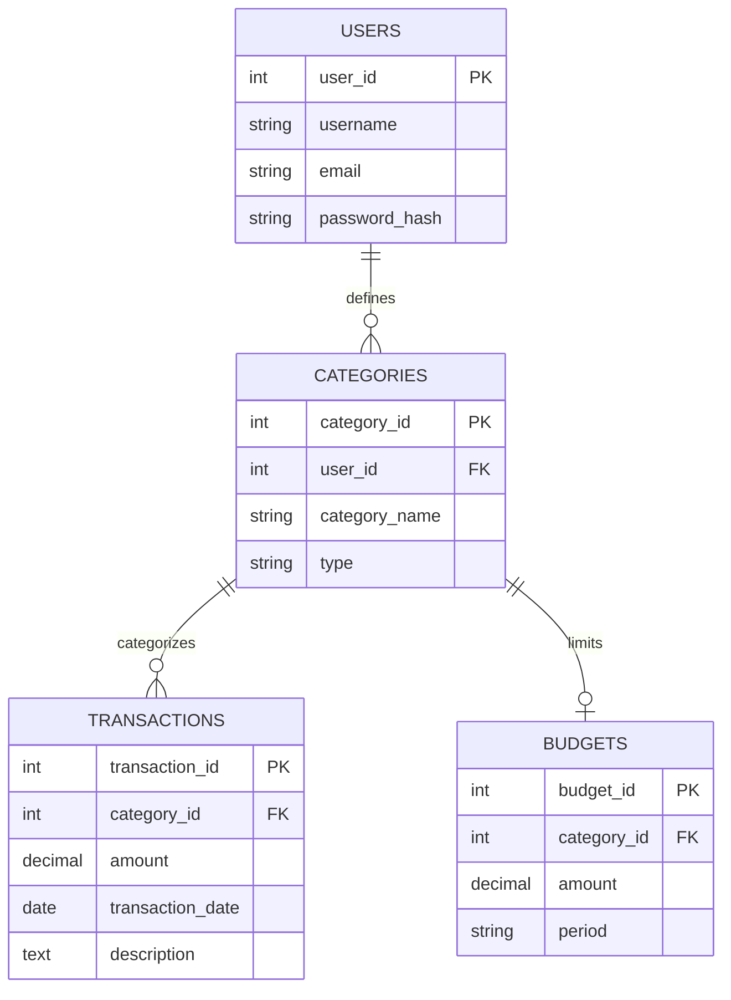

# Milestone 2: Normalization Justification

## Current Schema Analysis
The initial schema had the following tables:
- `users`
- `categories`
- `expenses`
- `income_records`
- `budgets`

### Issues Identified:
1. **Transitive Dependencies (3NF Violation):**
   - In `expenses`, the `user_id` is present alongside `category_id`. Since `category_id` is uniquely associated with a `user_id` in the `categories` table, `user_id` in `expenses` is transitively dependent on the primary key `expense_id` via `category_id`.
   - Similar issues exist in the `budgets` table.
2. **Inconsistent Income Handling:**
   - `income_records` uses `source_name` as a literal string instead of linking to the `categories` table, despite the `categories` table having a `type` field that supports 'INCOME'.

---

## 3NF Normalized Schema Design

### 1. Table: `users`
| Column | Type | Constraints |
|--------|------|-------------|
| `user_id` | INT | PRIMARY KEY, AUTO_INCREMENT |
| `username` | VARCHAR(64) | UNIQUE, NOT NULL |
| `email` | VARCHAR(255) | UNIQUE, NOT NULL |
| `password_hash` | VARCHAR(255) | NOT NULL |

**Justification:** Already in 3NF. No partial or transitive dependencies.

### 2. Table: `categories`
| Column | Type | Constraints |
|--------|------|-------------|
| `category_id` | INT | PRIMARY KEY, AUTO_INCREMENT |
| `user_id` | INT | FOREIGN KEY (users.user_id), NOT NULL |
| `category_name` | VARCHAR(128) | NOT NULL |
| `type` | ENUM('INCOME', 'EXPENSE') | NOT NULL |

**Justification:** Links users to their specific categories. This is the source of truth for user-category ownership.

### 3. Table: `transactions` (Refactored from `expenses` and `income_records`)
| Column | Type | Constraints |
|--------|------|-------------|
| `transaction_id` | INT | PRIMARY KEY, AUTO_INCREMENT |
| `category_id` | INT | FOREIGN KEY (categories.category_id), NOT NULL |
| `amount` | DECIMAL(10,2) | NOT NULL, CHECK (amount > 0) |
| `transaction_date` | DATE | NOT NULL |
| `description` | TEXT | NULL |

**Justification:** 
- **Removed `user_id`**: By removing `user_id`, we eliminate the transitive dependency `transaction_id -> category_id -> user_id`. Ownership is now strictly managed through the category.
- **Unified Transactions**: Merged income and expenses into a single table. The nature of the transaction (income vs expense) is determined by the linked category's `type`.

### 4. Table: `budgets`
| Column | Type | Constraints |
|--------|------|-------------|
| `budget_id` | INT | PRIMARY KEY, AUTO_INCREMENT |
| `category_id` | INT | FOREIGN KEY (categories.category_id), UNIQUE, NOT NULL |
| `amount` | DECIMAL(10,2) | NOT NULL, CHECK (amount > 0) |
| `period` | ENUM('DAILY', 'WEEKLY', 'MONTHLY', 'ANNUAL') | NOT NULL |

**Justification:**
- **Removed `user_id`**: Similar to transactions, the `user_id` was redundant as it is accessible via the `category_id`.
- **Relationship**: 1:1 or 1:Many relationship between category and budget depending on requirements. Here, we enforce one budget per category per period (can be refined).

---

## Final ERD (Mermaid)

